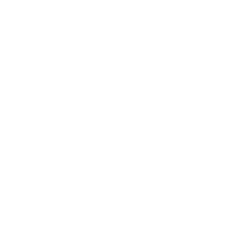

<div align="center">
  
</div>

> 完成度 0.1%
## 这是什么玩意儿？
基于 electron 实现的 shadowsocks 用户PAC规则管理工具

## 平台支持
- windows 7
- mac os 10.8

## Quick start
```bash
npm start
```
or
```
npm run dev
```

## Overview
- webpack 4
- electron
- electron-package
- react 16
- reach-router
- ant-design
- less

## DevTools

Toggle DevTools:

* OSX: <kbd>Cmd</kbd> <kbd>Alt</kbd> <kbd>I</kbd> or <kbd>F12</kbd>
* Linux: <kbd>Ctrl</kbd> <kbd>Shift</kbd> <kbd>I</kbd> or <kbd>F12</kbd>
* Windows: <kbd>Ctrl</kbd> <kbd>Shift</kbd> <kbd>I</kbd> or <kbd>F12</kbd>

## Packaging

Modify [package.config.js](./config/package.config.js) to edit package info.

For a full list of options see: https://github.com/electron-userland/electron-packager/blob/master/docs/api.md.

Create a package for OSX, Windows and Linux
```
npm run pack
```

Or target a specific platform
```
npm run pack:mac
npm run pack:win
npm run pack:linux
```
